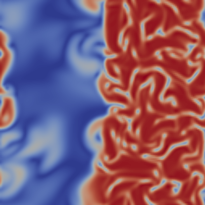

# OpenFOAM solver for active liquid crystal mixtures

This OpenFOAM solver integrates the dynamics of mixture of an active liquid crystal with an isotropic fluid. It has been used to get most of the results of https://arxiv.org/abs/2206.12574
